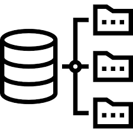

#  BUP vector

<a href="https://www.legosoft.com.mx"></a>
Python microservice that create a text vectors from iths nodes neighborhood in order to use 'similarity' Neo4j function
to be used with query using LLM and OpenAI. This microservice is developed in Python and the interface is a POC for
the `chat-gpt`  front microservice.

The algorith is based in the article:

https://towardsdatascience.com/integrate-llm-workflows-with-knowledge-graph-using-neo4j-and-apoc-27ef7e9900a2

We used the Neo4j BUP database.

This microservice works with the `chat-gpt` microservice which is the one to use the API rest defined
in this microservice using `Flask` . The way they communicate is using REST calls without security.

### Running in a IDE environment

When the `bup-vector` microservice is run inside the IntelliJ we need to add the next lines:

<it runs using the Python 3.10 `bup-vector` environment defined in Ananconda.

## Run using the bash shell

First you have to go to the `/bup-vector` directory.

1. Build the Docker Pyhton image:

```bash
docker build -t bup-vector .
```

Or if we want ti run it and create the container also (but at root directory) run:

```bash
bash start.sh 
```

2. Create the container with docker compose:

A better way it to create the container using dock-comse in order to stay in the proper group of
containers (i.e., `docker-gen-ai`) inside the docker desktop.

```bash
docker cd docker-gen-ai
docker docker-compose up
```

## Example questions done to this microservice:

### For Company to Company:

- ¿Qué compañías tienen relación con la compañía ACME SA de CV?
- ¿Cuales son las compañías subsidiarias de ACME SA de CV?
- ¿Quién es similar a la compañía ACME SA de CV?
- ¿Qué compañías pertenecen al negocio de Financieras?

### For Person to Person

- ¿Quién tiene relación con Jesus Torres Beckmann?
- ¿Quién trabaja en ACME SA de CV?
- ¿Que persona es similar a Diego Balli Armella?
- ¿Quienes son solteros?

### For Company to Person

- ¿En que compañía trabaja la persona Patrico Garcia Cano?
- ¿Que compañía tiene como contador a la persona Juan Perez Hernández?
- ¿Que compañías son similares, por su personas a ACME SA de CV?

### And for Person to Company

- ¿Que persona es el director de la compañía ACME SA de CV?
- ¿Que persona es el contador de la compañía ACME SA de CV?
- ¿Que personas son similares, por su compañía a Diego Balli Armella?


## References:

- Build a Chatbot on Your CSV Data With LangChain and OpenAI
https://betterprogramming.pub/build-a-chatbot-on-your-csv-data-with-langchain-and-openai-ed121f85f0cd
- Langchain4j-examples:
https://github.com/langchain4j/langchain4j-examples/tree/main
- Using LLaMA 2.0, FAISS and LangChain for Question-Answering on Your Own Data
https://medium.com/@murtuza753/using-llama-2-0-faiss-and-langchain-for-question-answering-on-your-own-data-682241488476
- Chroma vector store class:
https://api.python.langchain.com/en/latest/vectorstores/langchain.vectorstores.chroma.Chroma.html#langchain.vectorstores.chroma.Chroma.from_documents
- Chromadb
https://pypi.org/project/chromadb/
- ChatGPT documentation
https://platform.openai.com/docs/models/overview
- 

Where the packages are: 


### Contact AI Legorreta

Feel free to reach out to AI Legorreta on [web page](https://legosoft.com.mx).


Version: 1.0
©LegoSoft Soluciones, S.C., 2024